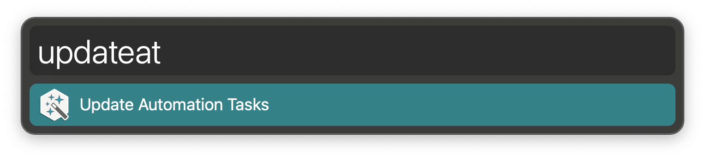

#  Update Automation Tasks Alfred Workflow

Update Automation Tasks During Alfred 5 Early Access

<a href='https://github.com/alfredapp/update-automation-tasks-workflow/releases/latest/download/Update.Automation.Tasks.alfredworkflow'>⤓ Download Workflow</a>

## About

Automation Tasks are one of the many new features of Alfred 5, [which is currently in Early Access](https://www.alfredapp.com/help/getting-started/early-access/). For the time being you need this Workflow to install and update them. By Alfred 5’s General Release, the process will be automatic.

Run `updateat` to bring your local copy of Automation Tasks up-to-date.

To learn more about Automation Tasks, [see their help page](https://www.alfredapp.com/help/workflows/automations/).

<a href='https://github.com/alfredapp/update-automation-tasks-workflow/releases/latest/download/Update.Automation.Tasks.alfredworkflow'>⤓ Download Workflow</a>
